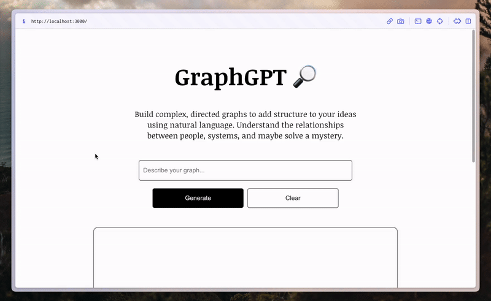

# GraphGPT
### Natural Language → Knowledge Graph

*Note: this is a toy project I built out over a weekend. If you want to use knowledge graphs in your project, check out [GPT Index](https://github.com/jerryjliu/gpt_index).*

GraphGPT converts unstructured natural language into a knowledge graph. Pass in the synopsis of your favorite movie, a passage from a confusing Wikipedia page, or transcript from a video to generate a graph visualization of entities and their relationships. 

Successive queries can update the existing state of the graph or create an entirely new structure. For example, updating the current state could involve injecting new information through nodes and edges or changing the color of certain nodes.

The current few-shot prompt guides GPT-3 in accurately understanding the JSON formatting GraphGPT requires for proper rendering. You can see the entire prompt in `public/prompts/main.prompt`. A major issue at the moment is latency. Due to the nature of OpenAI API calls, it takes up to 20 seconds to receive a response.

## Prompts

Prompts are located in the `public/prompts` folder. Read [this](https://twitter.com/varunshenoy_/status/1625224544561819648?s=20) Twitter thread I put together to learn more about how these prompts were designed.

## Setup

1. Run `npm install` to download required dependencies (currently just [react-graph-vis](https://github.com/crubier/react-graph-vis)).
2. Make sure you have an [OpenAI API key](https://platform.openai.com/account/api-keys). You will enter this into the web app when running queries.
3. Run `npm run start`. GraphGPT should open up in a new browser tab.
